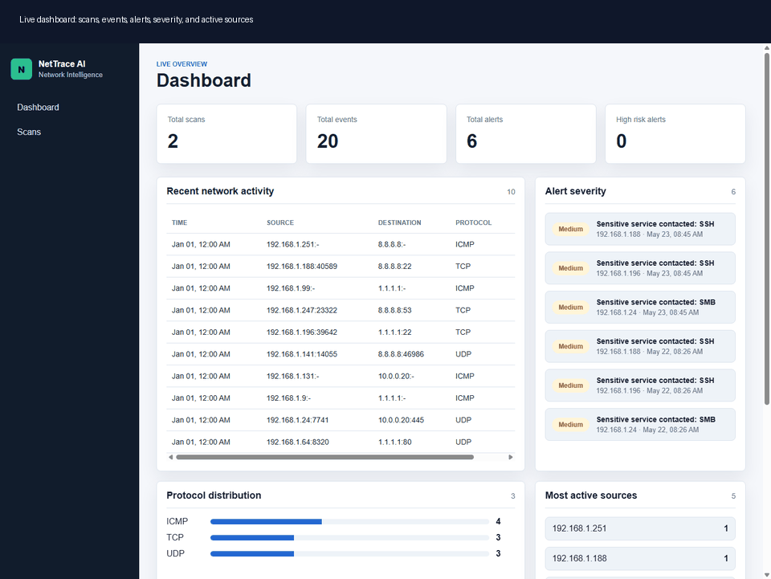
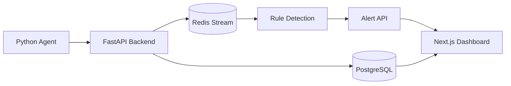
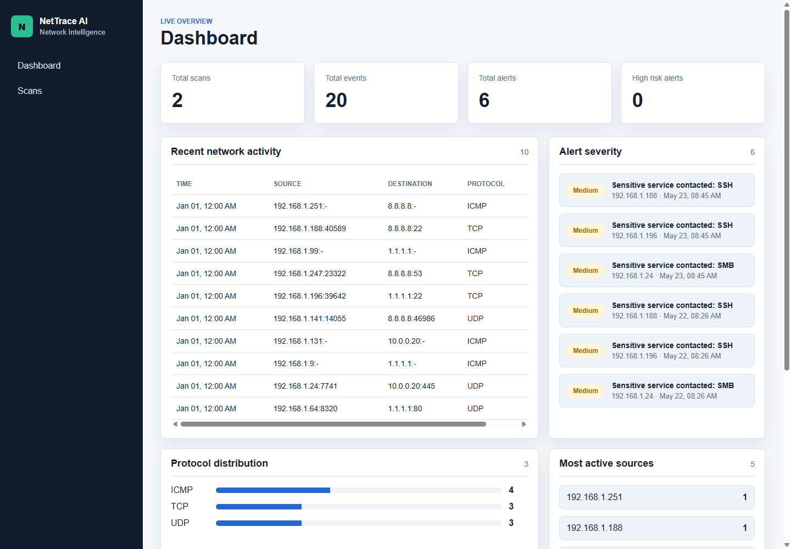
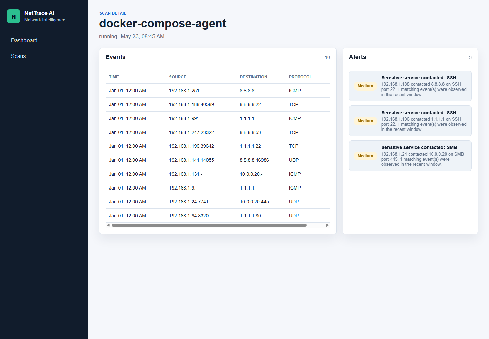
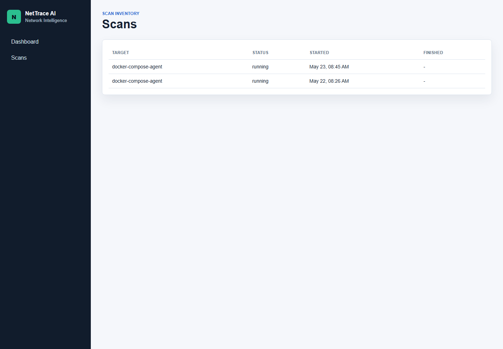

# NetTrace AI

NetTrace AI is a local, end-to-end network intelligence platform. A Python agent produces packet metadata, a FastAPI backend validates and stores it, Redis Streams carry events through the pipeline, rule-based detection generates alerts, and a Next.js dashboard shows what happened in near real time.



## What It Shows



- Metadata-only packet collection with no payload storage.
- Validated event ingestion through FastAPI and Pydantic.
- PostgreSQL models and Alembic migrations for scans, events, and alerts.
- Redis Stream publishing for the event pipeline.
- Rule-based anomaly detection for port scans, DNS spikes, sensitive ports, large packets, and unknown protocols.
- Alert explanation endpoint with readable recommended actions.
- Dashboard views for scan history, event activity, alert severity, protocol distribution, and active sources.
- Docker Compose stack for backend, frontend, PostgreSQL, Redis, and agent.
- Unit, integration, E2E, CI, rate limiting, CORS, safe API errors, and tracked-file secret scanning.

## Screenshots

| Live dashboard | Scan detail |
| --- | --- |
|  |  |

| Scan inventory |
| --- |
|  |

## How It Works

The agent can either generate deterministic sample traffic or parse live packet metadata with Scapy. Each event is posted to the backend, validated, written to PostgreSQL, published to `network_events` in Redis, evaluated by the detection service, and exposed to the dashboard through query APIs. The dashboard polls for updates, so new events and alerts appear without a manual refresh.

## What I Learned

I built this project in small, deliberate phases so I could understand each layer instead of just wiring tools together. I started with a clean repository structure, then added the backend foundation, database migrations, agent event contracts, Redis streaming, detection rules, frontend integration, Docker, E2E tests, CI, and security hardening. The biggest learning was how production-style systems are shaped by boundaries: validation at the API edge, clear data models, repeatable migrations, isolated tests, observable flows, and privacy rules that are enforced by design rather than written as an afterthought.

## Tech Stack

- **Backend:** Python, FastAPI, Pydantic, SQLAlchemy, Alembic, Pytest
- **Agent:** Python, Scapy, deterministic sample event generator
- **Data:** PostgreSQL, Redis Streams
- **Frontend:** Next.js, React, TypeScript, Vitest
- **DevOps:** Docker, Docker Compose, GitHub Actions
- **Security:** CORS allowlist, rate limiting, safe error responses, secret scan

## Quick Start

Run the full stack:

```bash
docker compose up --build
```

Open:

```text
Frontend: http://localhost:3000
Backend:  http://localhost:8000
Health:   http://localhost:8000/health
Metrics:  http://localhost:8000/metrics
```

The compose stack starts PostgreSQL, Redis, the backend, the frontend, and a one-shot agent that creates a scan and sends sample packet metadata.

## Test Commands

```bash
cd backend
python -m pytest
```

```bash
cd agent
python -m pytest
```

```bash
cd frontend
npm test
npm run lint
```

```bash
cd e2e
python -m pytest
```

```bash
python scripts/scan_secrets.py
```

## API Examples

```text
GET  /health
GET  /metrics
POST /api/v1/scans
GET  /api/v1/scans
POST /api/v1/events
GET  /api/v1/alerts
GET  /api/v1/alerts/{alert_id}/explanation
```

## Documentation

- [Architecture](Docs/Architecture.md)
- [API](Docs/Api.md)
- [Testing](Docs/Testing.md)
- [Security](Docs/Security.md)
- [Build Report](Docs/Report.md)

## Privacy And Security

NetTrace AI stores metadata only: timestamps, IPs, ports, protocol, packet size, and scan IDs. It does not store packet payloads or inspect encrypted content. The backend rejects invalid payloads, rate-limits clients, restricts CORS origins, returns safe error responses, and scans tracked files for common secret patterns in CI.

## Repository Layout

```text
backend/      FastAPI API, models, services, migrations, tests
agent/        Metadata generator, capture parser, sender, tests
frontend/     Next.js dashboard, components, API client, tests
e2e/          Docker Compose based end-to-end tests
media/        README demo GIF and screenshots
scripts/      Local project automation such as secret scanning
.github/      GitHub Actions workflows
```

## Future Improvements

- Move rate limiting counters from process memory to Redis for multi-instance deployments.
- Add optional WebSocket or Server-Sent Events updates after the polling baseline.
- Add authentication and role-based access once the local V1 system is complete.
- Add richer observability dashboards for request latency, detection counts, and rate-limit events.
